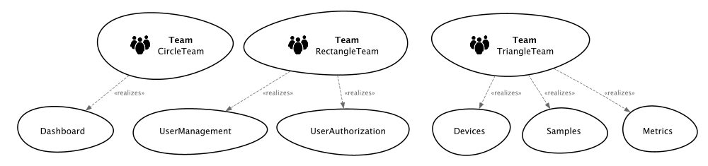
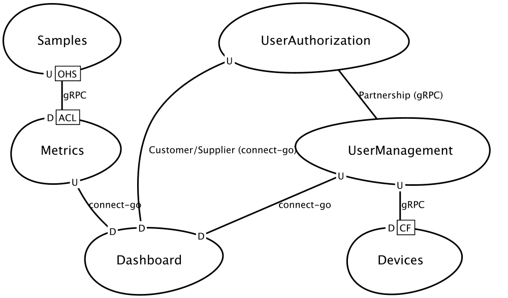

# ContextMapper (tool for Bounded Context Maps, from DDD)

- Tool: https://contextmapper.org
- VS Code plugin: "Context Mapper", command to generate images: "Generate Graphical Context Map"

## Teams map

## Services map

