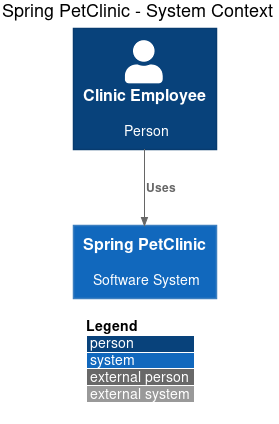
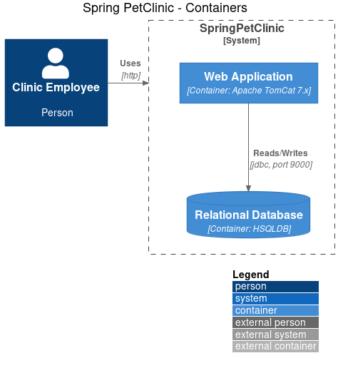
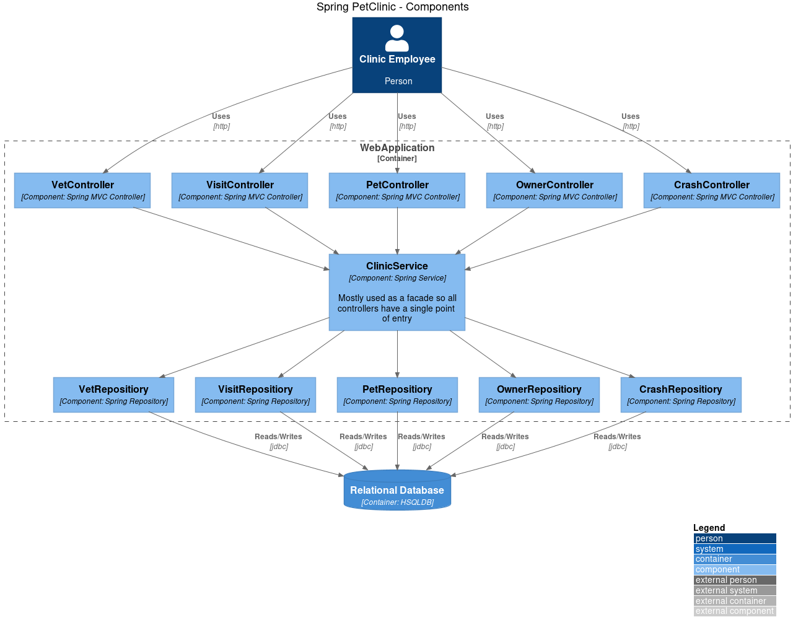

# PlantUML + C4

How to use PlantULM + C4: <https://github.com/plantuml-stdlib/C4-PlantUML>

## Install under VS Code
1. install VS Code extension "PlantUML" by jebbs
2. open .puml document
3. ALT + D to render the diagram

## Generate PNG from .puml

```bash
plantuml petclinic_context.puml # will generate: petclinic_context.png
```

## C1 - Context Diagram
Available shapes:
- Person(alias, label, description="")
- Person_Ext(alias, label, description="")
- System(alias, label, description="")
- System_Ext(alias, label, description="")
- Boundary(alias, label) { ... }
- System_Boundary(alias, label) { ... }
- Enterprise_Boundary(alias, label) { ... }

Example:
```csharp
System_Boundary(system, "Pet Clinic") {
    Person(ClinicEmployee, "Clinic Employee", "Person")
    System(SpringPetClinic, "Spring PetClinic", "Software System")
}
```

## C2 - Container Diagram
Available shapes - Context shapes and also:
- Container(alias, label, technology, description="")
- ContainerDb(alias, label, technology, description="")
- ContainerQueue(alias, label, technology, description="")
- Container_Ext(alias, label, technology, description="")
- ContainerDb_Ext(alias, label, technology, description="")
- ContainerQueue_Ext(alias, label, technology, description="")
- Container_Boundary(alias, label, technology, description="")

Example:
```csharp
Container(WebApplication, "Web Application", "Container: Apache TomCat 7.x")
```

## C3 - Component Diagram
Available shapes - Context and Container shapes and also:
- Component(alias, label, technology, description="")
- ComponentDb(alias, label, technology, description="")
- ComponentQueue(alias, label, technology, description="")
- Component_Ext(alias, label, technology, description="")
- ComponentDb_Ext(alias, label, technology, description="")
- ComponentQueue_Ext(alias, label, technology, description="")

Example:
```csharp
Component(ClinicService, "ClinicService", "Component: Spring Service", "Mostly used as a facade so all controllers have a single point of entry")
```

## Relationships

Available types of relationships:
- Rel(from, to, label) - regular unidirectional relationship
- Rel_Back(from, to, label) - reverse relationship
- Rel_U(from, to, label)
- Rel_D(from, to, label)
- Rel_L(from, to, label)
- Rel_R(from, to, label)
- Rel_Neighbor(from, to, label)
- Rel_Back_Neighbor(from, to, label)
- BiRel(from, to, label) - bidirectional relationship

Available relationship layout helpers:
- Lay_D(from, to)
- Lay_U(from, to)
- Lay_L(from, to)
- Lay_R(from, to)

Example:
```csharp
Rel(ClinicEmployee, SpringPetClinic, "Uses", "http")
Lay_D(ClinicEmployee, SpringPetClinic)
```

## Layouts

Available layouts:
- LAYOUT_TOP_DOWN() - default
- LAYOUT_LEFT_RIGHT()
- LAYOUT_AS_SKETCH() - squiggling borders
- HIDE_STEREOTYPE() - hides <<stetreotype>>
- LAYOUT_WITH_LEGEND() - displays color legend and hides <<stetreotype>>

Example:
```csharp
LAYOUT_WITH_LEGEND()
```


## C4 shapes definitions: local stored vs remote stored

Shapes to PlantUML are like CSS to HTML - they define style; what a system looks like, what a container, a component, a person looks like.  
C4 has it's own set of shapes that can be used from PlantUML, but the set is not installed by default.  
You can find predefined shapes at <https://github.com/plantuml-stdlib/C4-PlantUML>  
In your .puml documents you can reference C4 shapes that are either:
- locally stored:
```csharp
@startuml
!include shapes/C4_Container.puml
(...)
```

- or github stored:
```csharp
@startuml
!include https://raw.githubusercontent.com/plantuml-stdlib/C4-PlantUML/master/C4_Container.puml
(...)
```

## Examples (by Simon Brown)

- PetClinic Context
```csharp
@startuml
!include shapes/C4_Context.puml

LAYOUT_WITH_LEGEND()

title Spring PetClinic - System Context

Person(ClinicEmployee, "Clinic Employee", "Person")
System(SpringPetClinic, "Spring PetClinic", "Software System")


Rel(ClinicEmployee, SpringPetClinic, "Uses")
@enduml
```


- PetClinic Containers  
```csharp
@startuml
!include shapes/C4_Container.puml

LAYOUT_WITH_LEGEND()

title Spring PetClinic - Containers

Person(ClinicEmployee, "Clinic Employee", "Person")
System_Boundary(SpringPetClinic, "SpringPetClinic") {
    Container(WebApplication, "Web Application", "Container: Apache TomCat 7.x")
    ContainerDb(RelationalDatabase, "Relational Database", "Container: HSQLDB")
}

Rel_Neighbor(ClinicEmployee, SpringPetClinic, "Uses", "http")
Rel(WebApplication, RelationalDatabase, "Reads/Writes", "jdbc, port 9000")
@enduml
```


- PetClinic Components  
```csharp
@startuml
!include shapes/C4_Component.puml

LAYOUT_WITH_LEGEND()

title Spring PetClinic - Components

Person(ClinicEmployee, "Clinic Employee", "Person")

Container_Boundary(WebApplication, "WebApplication") {
    Component(VetController, "VetController", "Component: Spring MVC Controller")
    Component(VisitController, "VisitController", "Component: Spring MVC Controller")
    Component(PetController, "PetController", "Component: Spring MVC Controller")
    Component(OwnerController, "OwnerController", "Component: Spring MVC Controller")
    Component(CrashController, "CrashController", "Component: Spring MVC Controller")

    Component(ClinicService, "ClinicService", "Component: Spring Service", "Mostly used as a facade so all controllers have a single point of entry")

    Component(VetRepositiory, "VetRepositiory", "Component: Spring Repository")
    Component(VisitRepositiory, "VisitRepositiory", "Component: Spring Repository")
    Component(PetRepositiory, "PetRepositiory", "Component: Spring Repository")
    Component(OwnerRepositiory, "OwnerRepositiory", "Component: Spring Repository")
    Component(CrashRepositiory, "CrashRepositiory", "Component: Spring Repository")

    Rel(VetController, ClinicService, " ")
    Rel(VisitController, ClinicService, " ")
    Rel(PetController, ClinicService, " ")
    Rel(OwnerController, ClinicService, " ")
    Rel(CrashController, ClinicService, " ")

    Rel(ClinicService, VetRepositiory, " ")
    Rel(ClinicService, VisitRepositiory, " ")
    Rel(ClinicService, PetRepositiory, " ")
    Rel(ClinicService, OwnerRepositiory, " ")
    Rel(ClinicService, CrashRepositiory, " ")
}
Rel(ClinicEmployee, VetController, "Uses", "http")
Rel(ClinicEmployee, VisitController, "Uses", "http")
Rel(ClinicEmployee, PetController, "Uses", "http")
Rel(ClinicEmployee, OwnerController, "Uses", "http")
Rel(ClinicEmployee, CrashController, "Uses", "http")

ContainerDb(RelationalDatabase, "Relational Database", "Container: HSQLDB")

Rel(VetRepositiory, RelationalDatabase, "Reads/Writes", "jdbc")
Rel(VisitRepositiory, RelationalDatabase, "Reads/Writes", "jdbc")
Rel(PetRepositiory, RelationalDatabase, "Reads/Writes", "jdbc")
Rel(OwnerRepositiory, RelationalDatabase, "Reads/Writes", "jdbc")
Rel(CrashRepositiory, RelationalDatabase, "Reads/Writes", "jdbc")
@enduml
```
