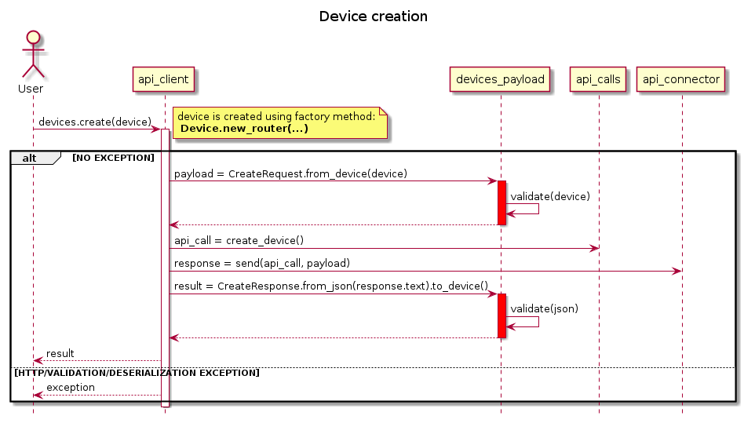

# PlantUML

PlantUML in a nutshell <https://plantuml.com>

## Examples

- Sequence diagram 
<https://plantuml.com/sequence-diagram>
```csharp
@startuml sequence

title Device creation
hide footbox
' skinparam handwritten true
' skinparam monochrome true
' actor, participant, database, collections, queue
'
actor User as user 


user -> api_client: devices.create(device) 
note right: device is created using factory method:\n **Device.new_router(...)**
activate api_client
    alt NO EXCEPTION
        api_client -> devices_payload: payload = CreateRequest.from_device(device)
        activate devices_payload #red
            devices_payload -> devices_payload: validate(device)
        return
        api_client -> api_calls: api_call = create_device()
        api_client -> api_connector: response = send(api_call, payload)
        api_client -> devices_payload: result = CreateResponse.from_json(response.text).to_device()
        activate devices_payload #red
            devices_payload -> devices_payload: validate(json)
        return
        user <-- api_client: result
    else HTTP/VALIDATION/DESERIALIZATION EXCEPTION
        user <-- api_client: exception
    end
deactivate
@enduml
```

