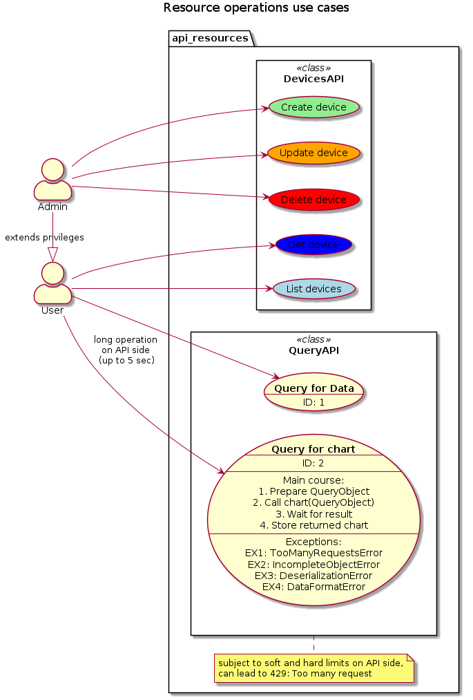

# PlantUML

PlantUML in a nutshell <https://plantuml.com>

## Customize the look

- `skinparam handwritten true` - squiggling borders
- `skinparam monochrome true` - black&white

## Examples

- Sequence diagram <https://plantuml.com/sequence-diagram>
```csharp
@startuml sequence

title Device creation
hide footbox
' skinparam handwritten true
' skinparam monochrome true
' actor, participant, database, collections, queue
'
actor User as user 


user -> api_client: devices.create(device) 
note right: device is created using factory method:\n **Device.new_router(...)**
activate api_client
    alt NO EXCEPTION
        api_client -> devices_payload: payload = CreateRequest.from_device(device)
        activate devices_payload #red
            devices_payload -> devices_payload: validate(device)
        return
        api_client -> api_calls: api_call = create_device()
        api_client -> api_connector: response = send(api_call, payload)
        api_client -> devices_payload: result = CreateResponse.from_json(response.text).to_device()
        activate devices_payload #red
            devices_payload -> devices_payload: validate(json)
        return
        user <-- api_client: result
    else HTTP/VALIDATION/DESERIALIZATION EXCEPTION
        user <-- api_client: exception
    end
deactivate
@enduml
```


- Component diagram <https://plantuml.com/component-diagram>

```csharp
@startuml component

title Components 

package "api_connection" {
    interface APIConnectorProtocol #red 
    note right: abstracts connection towards http api
    [APIConnector] - APIConnectorProtocol: provide
}

package "tests" {
    component StubAPIConnector
    note right: allows to test eg. DevicesAPI without spinning actual http server
    [StubAPIConnector] -- APIConnectorProtocol: provide
}
package "api_resources" {
    APIConnectorProtocol )..# [DevicesAPI]: require
    APIConnectorProtocol )..# [UsersAPI]: require
    APIConnectorProtocol )..# [PlansAPI]: require
}

package "public" {
    [Device]
}

package "requests_payloads" {
    [CreateRequest]
}

package "api_calls" {
    [create_device]
}
[DevicesAPI] --> [create_device]: use
[DevicesAPI] --> [Device]: use
[DevicesAPI] --> [CreateRequest]: use
[CreateRequest] -> [Device]: use
@enduml
```


-  Activity diagram <https://plantuml.com/activity-diagram-beta>

```csharp
@startuml activity

title Bulk user create from .yaml
!pragma useVerticalIf off

start
    :users = load users from .yaml file;
    if (load successful?) then (no)
        :print failure;
        stop
    else (yes)
    endif

    partition "Create Users" {
        while (has more users?) is (yes)
            :pop user dict from users;
            :deserialize User from user dict;
            if (deserialization successful?) then (yes)
                #lightgreen:http request user create;
            else (no)
                #red:log error;
            endif
        endwhile (no)
    }
    :print num users created;
stop
@enduml
```


- UseCase diagram <https://plantuml.com/use-case-diagram>  
Describing a Use Case <https://seilevel.com/business-analyst-resources/business-requirements-models-templates/use-cases/>

```csharp
@startuml usecasehttps://plantuml.com/use-case-diagram

title Resource operations use cases

left to right direction
' top to bottom direction
'
skinparam actorStyle awesome

actor "User" as user
actor "Admin" as admin
admin -|> user: extends privileges

package api_resources{
    rectangle DevicesAPI <<class>>{
        usecase "Create device" as create_device #lightgreen
        usecase "Update device" as update_device #orange
        usecase "Delete device" as delete_device #red
        usecase "Get device" as get_device #blue
        usecase "List devices" as list_devices #lightblue
    }
    admin --> create_device
    admin --> update_device
    admin --> delete_device
    user --> get_device
    user --> list_devices

    rectangle QueryAPI <<class>> {
        usecase query_data as "**Query for Data**
        --
        ID: 1
        "
        
        usecase query_chart as "**Query for chart**
        --
        ID: 2
        --
        Main course:
        1. Prepare QueryObject
        2. Call chart(QueryObject)
        3. Wait for result
        4. Store returned chart
        --
        Exceptions:
        EX1: TooManyRequestsError
        EX2: IncompleteObjectError
        EX3: DeserializationError
        EX4: DataFormatError
        " 
    }
    user --> query_data
    user --> query_chart: long operation\non API side\n (up to 5 sec)
    note bottom of QueryAPI: subject to soft and hard limits on API side,\ncan lead to 429: Too many request 
}
@enduml
```


- Class diagram <https://plantuml.com/class-diagram>

```csharp
@startuml class

title Device and it's innards

package "public" {
    enum AuthProtocol {
        none
        md5
        sha
    }

    enum PrivProtocol {
        none
        des
        aes
    }

    class SNMPv3Conf {
        +user_name: str
        +auth_pass: str 
        +priv_pass: str
        +with_auth(...)
        +with_priv(...)
    }
    AuthProtocol --* SNMPv3Conf
    PrivProtocol --* SNMPv3Conf

    class DeviceLabel {
        +id: int
        +name: str
        +color: str
    }

    class Site {
        +site_name: str
        +longitude: float
        +latitude: float
    }

    class Device #pink {
        +id: int
        +device_type: DeviceType
        +device_subtype: DeviceSubtype
        +...
        +new_dns(...)
        +new_router(...)
    }
    note right: new_dns(...) and new_router(...) \nare convenient constructors

    SNMPv3Conf --o Device
    DeviceLabel --o Device
    Site --o Device
}

@enduml
```


- Mindmap <https://plantuml.com/mindmap-diagram>

```csharp
@startmindmap mindmap

title Resource and operations tree

<style>
mindmapDiagram {
  .green {
    BackgroundColor lightgreen
  }
  .red {
    BackgroundColor red
  }
  .orange {
    BackgroundColor orange
  }
  .blue {
    BackgroundColor lightblue
  }
  .violet {
    BackgroundColor violet
  }
}
</style>


*[#Yellow] api_client
 * devices_api
  * create() <<blue>>
  * get() <<green>>
  * update() <<orange>>
  * delete() <<red>>

' left side '

 * query_api
  * url <<violet>>
   *_ url
  * data() <<violet>>
   *_ rows
  * chart() <<violet>>
   *_ image_type
   *_ image_data
@endmindmap
```

